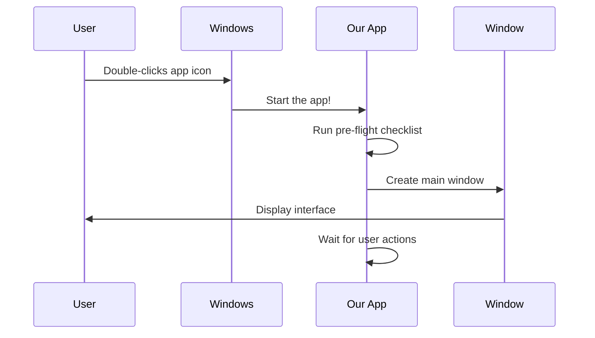
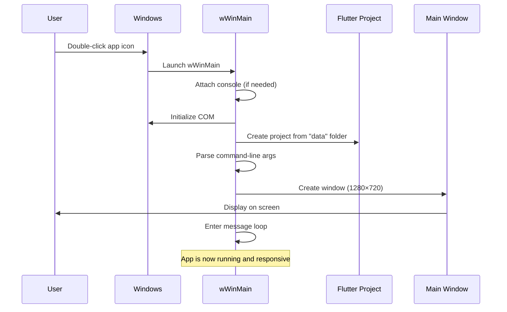

# Chapter 1: Application Entry Point and Initialization

Welcome to the first chapter of our Public Safety Application tutorial! In this chapter, we'll explore how a Windows application starts up and prepares itself to run. Think of this as learning how to start a car—before you can drive, several important things need to happen first: turning the key, the engine warming up, systems checking, and the dashboard lighting up. Similarly, our application goes through a careful startup sequence before you see anything on screen.

## What Problem Does This Solve?

Imagine you've just built a beautiful house with all the rooms decorated and furniture in place. But before anyone can live there, you need to:

1. **Connect the utilities** (water, electricity, gas)
2. **Turn on the heating system**
3. **Unlock the front door**
4. **Set up the security system**

Similarly, before our Public Safety Application can display its user interface and help keep people safe, it needs to go through its own "move-in checklist." This initialization process ensures everything is ready for the user to interact with the app.

**Our central use case:** When a user double-clicks the Public Safety Application icon on their Windows computer, the app should smoothly start up, connect to necessary Windows services, and display a responsive window—all without the user having to think about the complex setup happening behind the scenes.

## The Big Picture: From Icon Click to Running App

Let's start with a bird's-eye view of what happens:



Now let's dive into what that "pre-flight checklist" actually contains!

## Key Concept 1: The Entry Point (Where It All Begins)

Every journey has a starting point. For our Windows application, that starting point is a special function called `wWinMain`. This is the very first function that runs when Windows launches your app.

Here's what it looks like:

```cpp
int APIENTRY wWinMain(_In_ HINSTANCE instance, 
                      _In_opt_ HINSTANCE prev,
                      _In_ wchar_t *command_line, 
                      _In_ int show_command) {
```

**Think of it like this:** When you order a pizza, the restaurant needs your address, phone number, and order details. Similarly, when Windows starts your app, it gives `wWinMain` important information:
- `instance` - A unique ID for this running application
- `command_line` - Any special instructions you gave when starting the app
- `show_command` - Whether to show the window normally, minimized, or maximized

**What happens next?** This function runs all our initialization steps, and then returns a number: `EXIT_SUCCESS` (0) if everything went well, or `EXIT_FAILURE` (1) if something went wrong.

## Key Concept 2: Console Attachment (Developer's Window)

The first step in our initialization is setting up debugging capabilities:

```cpp
if (!::AttachConsole(ATTACH_PARENT_PROCESS) && 
    ::IsDebuggerPresent()) {
  CreateAndAttachConsole();
}
```

**What does this do?**

When developers run the app from a command line or debugging tool, this code connects the app to a console window where messages can be displayed.

**Analogy:** Imagine you're baking a cake and you want to narrate each step out loud so someone can learn. The console is like having a speaker system that broadcasts your narration. Regular users don't need this, but it's invaluable for developers troubleshooting issues.

**Example scenario:**
- **Input:** Developer runs `women_safety_app.exe` from PowerShell
- **Output:** The app attaches to PowerShell, and any debug messages appear right there in the terminal
- **User experience:** Normal users who double-click the icon won't see any console—it just works invisibly

## Key Concept 3: COM Initialization (Turning On Communication Systems)

Next, we initialize Windows COM (Component Object Model):

```cpp
::CoInitializeEx(nullptr, COINIT_APARTMENTTHREADED);
```

**What is COM?**

COM is Windows' way of letting different software components talk to each other. Many Windows features our app might use—like file dialogs, clipboard access, or drag-and-drop—require COM to be initialized first.

**Analogy:** Think of COM like turning on the telephone system in a large office building. Once the phone lines are active, different departments can call each other. Without it, everyone would be isolated.

**Important note:** At the end of our application (when it's shutting down), we must call:

```cpp
::CoUninitialize();
```

This properly "hangs up the phone" and cleans up resources.

## Key Concept 4: Creating the Flutter Project

Now we get to the heart of our application—the Flutter project:

```cpp
flutter::DartProject project(L"data");
```

**What is Flutter?**

Flutter is a modern framework for building beautiful user interfaces. It's what makes our Public Safety Application look good and work smoothly across different devices.

**What does this line do?**

It creates a Flutter project object and tells it to look in the `data` folder for all the application files (images, fonts, code, etc.).

**Analogy:** This is like opening a recipe book that contains all the instructions for making your meal. The recipe book (Flutter project) is in the kitchen cabinet (the "data" folder), and we're pulling it out to start cooking.

## Key Concept 5: Command-Line Arguments (Special Instructions)

Sometimes users or developers want to give the app special instructions when it starts:

```cpp
std::vector<std::string> command_line_arguments =
    GetCommandLineArguments();

project.set_dart_entrypoint_arguments(
    std::move(command_line_arguments));
```

**What are command-line arguments?**

These are extra instructions you can provide when launching an app from a terminal or shortcut.

**Example usage:**
```
women_safety_app.exe --debug-mode --test-data
```

In this example, the app receives two arguments: `--debug-mode` and `--test-data`. The app can then behave differently based on these flags—perhaps loading test data instead of real emergency contacts.

**Real-world analogy:** It's like telling a taxi driver, "Take me to Main Street, and please take the scenic route." The destination is the main instruction, but "scenic route" is an extra argument that modifies the behavior.

## Key Concept 6: Creating the Main Window

Now comes the exciting part—creating the actual window users will see:

```cpp
FlutterWindow window(project);
Win32Window::Point origin(10, 10);
Win32Window::Size size(1280, 720);
```

Let's break this down piece by piece:

**Line 1:** Create a Flutter window object connected to our project

**Line 2:** Set the window's position—10 pixels from the left edge of the screen, 10 pixels from the top

**Line 3:** Set the window's size—1280 pixels wide by 720 pixels tall (a nice 16:9 aspect ratio, like an HD TV)

Now we actually create the window:

```cpp
if (!window.Create(L"women_safety_app", origin, size)) {
  return EXIT_FAILURE;
}
```

**What happens here?**

- The app tries to create a window with the title "women_safety_app"
- If successful, the window appears on screen at position (10, 10) with size 1280×720
- If it fails (maybe the computer is out of memory), the app returns `EXIT_FAILURE` and stops

**Visual example:**

```
Screen (1920×1080)
┌─────────────────────────────────────┐
│ (0,0)                               │
│    (10,10)                          │
│    ┌──────────────────┐             │
│    │ women_safety_app │             │
│    │                  │             │
│    │   [App Content]  │             │
│    │                  │             │
│    │  1280 × 720      │             │
│    └──────────────────┘             │
│                                     │
└─────────────────────────────────────┘
```

## Key Concept 7: Window Behavior Configuration

After creating the window, we set an important behavior:

```cpp
window.SetQuitOnClose(true);
```

**What does this mean?**

When the user clicks the X button to close the window, the entire application should shut down.

**Why is this important?**

Without this setting, closing the window might leave the app running invisibly in the background, consuming memory and resources. That would be confusing and problematic!

**Analogy:** It's like setting your car so that when you turn off the engine, all the lights and radio also turn off automatically. You wouldn't want them draining your battery!

## Key Concept 8: The Message Loop (The Beating Heart)

Finally, we reach the most important part—the message loop:

```cpp
::MSG msg;
while (::GetMessage(&msg, nullptr, 0, 0)) {
  ::TranslateMessage(&msg);
  ::DispatchMessage(&msg);
}
```

**What is the message loop?**

Windows applications don't actively "do things" all the time. Instead, they sit and wait for "messages" from Windows. A message might be:
- "User clicked the mouse"
- "User pressed a key"
- "Window needs to redraw itself"
- "Time to shut down"

**How it works:**

1. `GetMessage(&msg, ...)` - Wait for the next message from Windows
2. `TranslateMessage(&msg)` - Convert raw keyboard input into readable characters
3. `DispatchMessage(&msg)` - Send the message to the appropriate handler

**Analogy:** Think of a receptionist at a busy hotel:
- They wait at the desk for the phone to ring or guests to approach
- When someone arrives, they listen to what's needed
- Then they direct that person to the right department or room

The loop keeps running continuously until the user closes the app. When the window closes, `GetMessage` returns false, the loop exits, and the application shuts down.

## Under the Hood: Helper Functions

Our initialization uses some helper functions defined in separate files. Let's peek at the most important ones:

### Getting Command-Line Arguments

Located in `windows/runner/utils.cpp`:

```cpp
std::vector<std::string> GetCommandLineArguments() {
  int argc;
  wchar_t** argv = ::CommandLineToArgvW(
      ::GetCommandLineW(), &argc);
  if (argv == nullptr) {
    return std::vector<std::string>();
  }
```

**What's happening?**

Windows provides command-line arguments in a special format (UTF-16, which can handle international characters). This function:
1. Gets the raw command line from Windows
2. Splits it into individual arguments
3. Converts them to UTF-8 (the format Flutter expects)

```cpp
  std::vector<std::string> command_line_arguments;
  
  // Skip the first argument (it's just the program name)
  for (int i = 1; i < argc; i++) {
    command_line_arguments.push_back(Utf8FromUtf16(argv[i]));
  }
  
  return command_line_arguments;
}
```

**Example transformation:**

**Input:** User runs `women_safety_app.exe --emergency-mode --contact=911`

**What the function does:**
- Receives: `["women_safety_app.exe", "--emergency-mode", "--contact=911"]`
- Skips the program name
- Returns: `["--emergency-mode", "--contact=911"]`

### Creating a Debug Console

Also in `windows/runner/utils.cpp`:

```cpp
void CreateAndAttachConsole() {
  if (::AllocConsole()) {
    FILE *unused;
    if (freopen_s(&unused, "CONOUT$", "w", stdout)) {
      _dup2(_fileno(stdout), 1);
    }
    // Similar for stderr...
  }
}
```

**What does this do?**

When running with a debugger, this creates a new console window and redirects all output (like error messages or debug prints) to it.

**Analogy:** It's like turning on subtitles for a movie—the main content (the app) plays normally, but you get extra information (debug output) displayed alongside it.

## Putting It All Together: The Complete Flow

Let's trace what happens step-by-step when a user starts the Public Safety Application:



**Complete walkthrough:**

1. **User action:** User double-clicks `women_safety_app.exe` on their desktop

2. **Windows responds:** Locates the entry point function `wWinMain` and calls it

3. **Console setup:** If the app was run from a terminal or debugger, attach to that console for debug output

4. **COM initialization:** Turn on Windows communication systems with `CoInitializeEx`

5. **Flutter project creation:** Load the Flutter project from the "data" folder

6. **Argument parsing:** Check if any command-line arguments were provided and pass them to Flutter

7. **Window creation:** Create a 1280×720 pixel window positioned at (10, 10) with the title "women_safety_app"

8. **Behavior configuration:** Set the window to quit the entire app when closed

9. **Message loop begins:** Enter the infinite loop that processes user interactions and keeps the app alive

10. **User interaction phase:** The app is now fully running! It responds to button clicks, text input, and everything else the user does

11. **User closes app:** When the user clicks the X button, the window closes

12. **Message loop exits:** `GetMessage` returns false, breaking the loop

13. **COM cleanup:** Call `CoUninitialize` to properly clean up resources

14. **Exit:** Return `EXIT_SUCCESS` to Windows, signaling the app closed normally

## Example: Launching with Different Configurations

Let's see how different launch methods affect the initialization:

### Normal User Launch

**Action:** User double-clicks the app icon

**What happens:**
- Console attachment skipped (no terminal to attach to)
- COM initializes
- Flutter project loads with default settings
- Command-line arguments: empty list `[]`
- Window appears at (10, 10) with size 1280×720
- Message loop starts

### Developer Debug Launch

**Action:** Developer runs from PowerShell: `.\women_safety_app.exe --verbose`

**What happens:**
- Console attaches to PowerShell window
- COM initializes  
- Flutter project loads
- Command-line arguments: `["--verbose"]`
- Window appears (same as above)
- Message loop starts
- Debug messages print to PowerShell

### Automated Testing Launch

**Action:** Test script runs: `women_safety_app.exe --test-mode --window-size=800x600`

**What happens:**
- Console attachment (if run from terminal)
- COM initializes
- Flutter project loads
- Command-line arguments: `["--test-mode", "--window-size=800x600"]`
- Flutter code can read these arguments and adjust behavior
- Window appears (Flutter code might resize it based on arguments)
- Message loop starts

## Key Takeaways

Congratulations! You've learned the foundation of how our Public Safety Application starts up. Here's what we covered:

1. **Entry point (`wWinMain`)** - The special function where Windows begins executing your app

2. **Console attachment** - Connecting to a terminal window for debug output when needed

3. **COM initialization** - Turning on Windows communication systems so components can talk to each other

4. **Flutter project creation** - Loading the app's user interface framework from the "data" folder

5. **Command-line argument parsing** - Reading special instructions that modify the app's behavior

6. **Window creation** - Building the actual window users see and interact with

7. **Message loop** - The infinite loop that keeps the app alive and responsive to user actions

8. **Proper cleanup** - Uninitializing COM when shutting down

**The big idea:** Just like a pilot's pre-flight checklist, our application initialization ensures everything is ready before the user can interact with the app. Each step builds on the previous one, creating a solid foundation for the application to run smoothly.

## What's Next?

Now that you understand how the application initializes and creates its main window, you're ready to dive deeper! In the next chapter, [Platform Native Containers](02_platform_native_containers.md), you'll learn how Flutter manages platform-specific containers and how the window interacts with the underlying Windows system. Get ready to explore the bridge between Flutter's cross-platform code and Windows-specific functionality!

