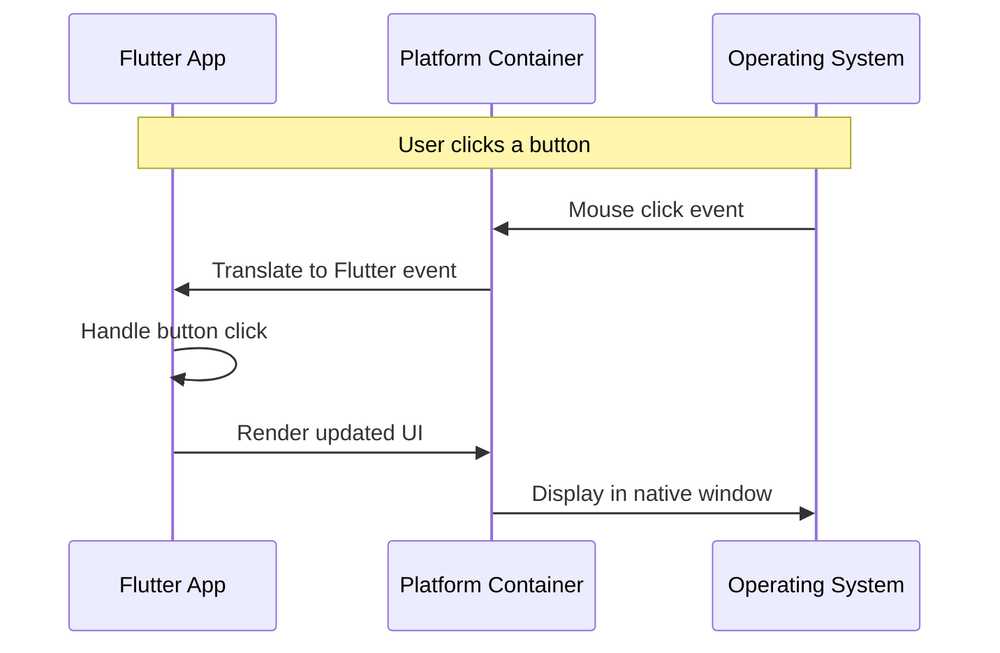
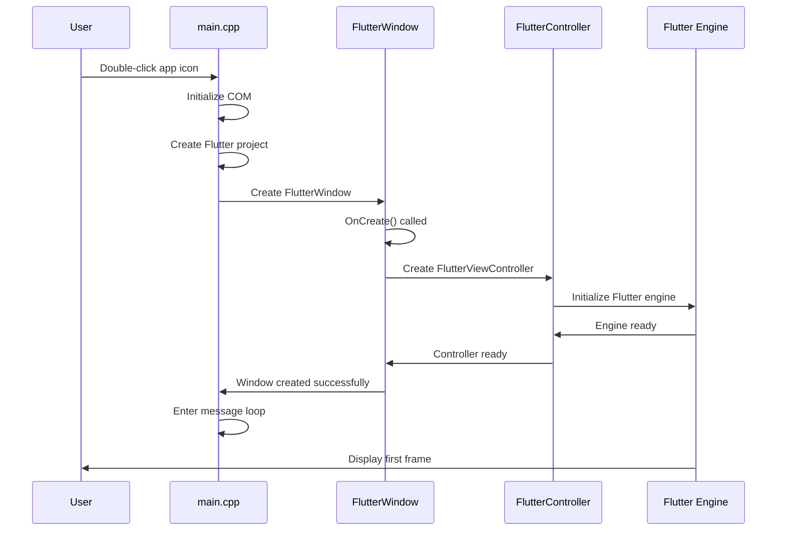
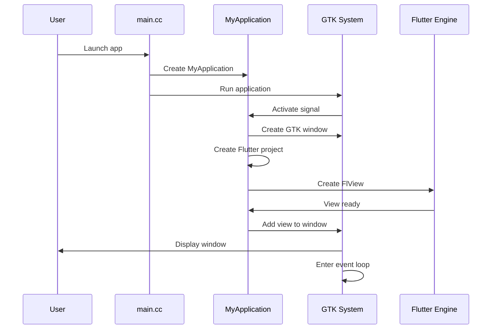

# Chapter 2: Platform Native Containers

Welcome back! In [Chapter 1: Application Entry Point and Initialization](01_application_entry_point_and_initialization.md), we learned how our Public Safety Application starts up on Windows—from the moment the user double-clicks the icon to when the main window appears on screen. We saw how `wWinMain` runs through an initialization checklist to get everything ready.

But here's an interesting question: What if our Public Safety Application needs to run on both Windows computers (like those in a dispatch center) and Linux systems (like those used by field coordinators)? Windows and Linux are completely different operating systems with different ways of creating windows, handling mouse clicks, and managing applications. How can the same Flutter app work on both?

That's exactly what we'll explore in this chapter!

## The Problem: One App, Many Operating Systems

**Central Use Case:** Imagine you've built a beautiful emergency response interface in Flutter. It has buttons for calling help, maps for tracking responders, and real-time status updates. You want this exact same app to run on:

- **Windows 11** desktops in the emergency dispatch center
- **Linux** workstations used by field coordinators
- Eventually, maybe even **iOS** tablets carried by first responders

Each operating system has its own rules:
- Windows expects apps to use the Win32 API for windows
- Linux uses GTK (GIMP Toolkit) for its graphical interface
- iOS uses completely different frameworks

Your Flutter code is the same, but each platform needs a different "wrapper" to display it properly.

**Think of it this way:** You have a beautiful painting (your Flutter app). But you can't just nail it directly to the wall! You need a picture frame. The thing is:
- A rustic cabin needs a wooden frame that fits its style
- A modern office needs a sleek metal frame
- A gallery needs a professional museum-quality frame

Similarly, your Flutter app needs different "frames" (containers) for different operating systems. These are **Platform Native Containers**.

## What Are Platform Native Containers?

Platform Native Containers are specialized wrapper classes that:
1. **Create a window** using the native operating system's methods
2. **Host the Flutter engine** inside that window
3. **Translate** between Flutter and the OS (handling things like mouse clicks, keyboard input, window resizing)
4. **Make the app feel native** on each platform

Our Public Safety Application uses:
- `FlutterWindow` for Windows
- `MyApplication` for Linux

Let's explore each one!

## Key Concept 1: The Windows Container (FlutterWindow)

On Windows, our app uses a class called `FlutterWindow`. Here's how it's defined:

```cpp
class FlutterWindow : public Win32Window {
  public:
    explicit FlutterWindow(
        const flutter::DartProject& project);
};
```

**What does this mean?**

- `FlutterWindow` is based on `Win32Window` (the standard Windows windowing system)
- It takes a Flutter project and wraps it in a Windows-compatible window
- The word `explicit` means you must create it intentionally—it won't happen by accident

**Analogy:** Think of `FlutterWindow` as a picture frame specifically designed for Windows walls. It has the right mounting hardware, the right size constraints, and follows Windows design guidelines.

### Creating a FlutterWindow

Remember from Chapter 1 how we created the window? Let's look at it again:

```cpp
flutter::DartProject project(L"data");
FlutterWindow window(project);
```

**Line 1:** Create a Flutter project (your app's code and resources)

**Line 2:** Create a Windows container and put the project inside it

Now let's set the window's position and size:

```cpp
Win32Window::Point origin(10, 10);
Win32Window::Size size(1280, 720);
window.Create(L"women_safety_app", origin, size);
```

**What happens here?**

1. Set the window to appear 10 pixels from the left and top of the screen
2. Make it 1280 pixels wide by 720 pixels tall
3. Actually create the window with the title "women_safety_app"

**Visual representation:**

```
Windows Desktop
┌────────────────────────────────────┐
│  (10,10) ← Window starts here      │
│  ┌──────────────────────┐          │
│  │ women_safety_app     │          │
│  │ ┌──────────────────┐ │          │
│  │ │                  │ │          │
│  │ │  Flutter App     │ │          │
│  │ │  Rendered Here   │ │          │
│  │ │                  │ │          │
│  │ └──────────────────┘ │          │
│  │    1280 × 720        │          │
│  └──────────────────────┘          │
│                                    │
└────────────────────────────────────┘
```

## Key Concept 2: The Linux Container (MyApplication)

On Linux, our app uses `MyApplication`. Here's its declaration:

```cpp
G_DECLARE_FINAL_TYPE(MyApplication, 
                     my_application, 
                     MY, APPLICATION,
                     GtkApplication)
```

**What does this mean?**

This is a special macro that declares `MyApplication` as a type of `GtkApplication`. GTK is the toolkit Linux uses to create graphical windows.

**Analogy:** If `FlutterWindow` is a picture frame for Windows walls, `MyApplication` is a frame designed for Linux walls—it uses different mounting hardware (GTK instead of Win32) but serves the same purpose.

### Creating a MyApplication

Here's how the Linux version starts (from `linux/main.cc`):

```cpp
int main(int argc, char** argv) {
  g_autoptr(MyApplication) app = 
      my_application_new();
}
```

**What's happening?**

- `my_application_new()` creates a new Linux application container
- `g_autoptr` is a smart pointer that automatically cleans up when done

Then we run it:

```cpp
return g_application_run(
    G_APPLICATION(app), argc, argv);
```

This starts the application and enters the event loop (similar to the Windows message loop we saw in Chapter 1).

## Key Concept 3: The Bridge Between Flutter and Native Code

Both containers serve as a **bridge** between your Flutter code and the native operating system. Let's visualize how this works:



**Step-by-step breakdown:**

1. **User clicks**: The user clicks a button in the app
2. **OS detects**: The operating system detects the mouse click
3. **Container translates**: The platform container translates the OS-specific click event into a format Flutter understands
4. **Flutter responds**: Flutter handles the click and updates the UI
5. **Rendering**: Flutter renders the new UI
6. **Container displays**: The container takes Flutter's output and displays it using native OS methods

**Analogy:** The container is like a translator at an international conference. Flutter speaks "Flutter language," Windows speaks "Win32 language," and Linux speaks "GTK language." The container translates between them so everyone can communicate!

## Under the Hood: How FlutterWindow Works (Windows)

Let's peek inside the Windows container to see what happens when it's created. The magic happens in the `OnCreate()` method:

```cpp
bool FlutterWindow::OnCreate() {
  if (!Win32Window::OnCreate()) {
    return false;
  }
```

**First step:** Call the base class's `OnCreate()` to set up the basic Windows window. If this fails, return false (creation failed).

Next, get the window's size:

```cpp
RECT frame = GetClientArea();
```

This retrieves the window's dimensions so we can tell Flutter how much space it has to draw in.

Now create the Flutter controller:

```cpp
flutter_controller_ = 
    std::make_unique<flutter::FlutterViewController>(
        frame.right - frame.left,  // width
        frame.bottom - frame.top,  // height
        project_);
```

**What's a FlutterViewController?**

This is the Flutter engine's way of controlling a view (a displayable area). We give it:
- The width of our window
- The height of our window  
- The project (our Flutter app)

Verify it worked:

```cpp
if (!flutter_controller_->engine() || 
    !flutter_controller_->view()) {
  return false;
}
```

If the engine or view didn't initialize properly, something went wrong—return false.

Register plugins:

```cpp
RegisterPlugins(flutter_controller_->engine());
```

**What are plugins?**

Plugins let Flutter talk to native platform features (like the camera, GPS, or file system). We'll cover this in [Chapter 3: Plugin Registration System](03_plugin_registration_system.md)!

Connect Flutter's view to the window:

```cpp
SetChildContent(
    flutter_controller_->view()->GetNativeWindow());
```

This tells Windows: "Put Flutter's rendered output inside this window."

Set up the display callback:

```cpp
flutter_controller_->engine()->SetNextFrameCallback([&]() {
  this->Show();
});
```

**What does this do?**

It says: "When Flutter finishes rendering the first frame, show the window." This prevents users from seeing a blank window before the app is ready.

Force an initial render:

```cpp
flutter_controller_->ForceRedraw();
return true;
```

Make sure Flutter draws at least one frame, then return true (creation succeeded).

## Under the Hood: How MyApplication Works (Linux)

Now let's see what happens when the Linux container activates. The key method is `my_application_activate()`:

```cpp
static void my_application_activate(
    GApplication* application) {
  MyApplication* self = MY_APPLICATION(application);
```

First, create a window using GTK:

```cpp
GtkWindow* window =
    GTK_WINDOW(gtk_application_window_new(
        GTK_APPLICATION(application)));
```

This creates a native Linux window connected to our application.

Decide on the window style:

```cpp
gboolean use_header_bar = TRUE;
#ifdef GDK_WINDOWING_X11
  if (GDK_IS_X11_SCREEN(screen)) {
    const gchar* wm_name = 
        gdk_x11_screen_get_window_manager_name(screen);
    if (g_strcmp0(wm_name, "GNOME Shell") != 0) {
      use_header_bar = FALSE;
    }
  }
#endif
```

**What's this checking?**

Linux has different desktop environments (GNOME, KDE, XFCE, etc.). This code detects which one is running:
- **GNOME**: Use a modern header bar
- **Other environments**: Use a traditional title bar

**Analogy:** It's like automatically choosing between a modern frameless picture frame for a contemporary gallery versus a traditional frame for a classic museum—the container adapts to its environment!

Set the window title:

```cpp
if (use_header_bar) {
  GtkHeaderBar* header_bar = 
      GTK_HEADER_BAR(gtk_header_bar_new());
  gtk_header_bar_set_title(header_bar, 
      "women_safety_app");
} else {
  gtk_window_set_title(window, 
      "women_safety_app");
}
```

Set the window size and show it:

```cpp
gtk_window_set_default_size(window, 1280, 720);
gtk_widget_show(GTK_WIDGET(window));
```

Create the Flutter project:

```cpp
g_autoptr(FlDartProject) project = 
    fl_dart_project_new();
```

Create the Flutter view:

```cpp
FlView* view = fl_view_new(project);
gtk_widget_show(GTK_WIDGET(view));
```

Add the Flutter view to the window:

```cpp
gtk_container_add(GTK_CONTAINER(window), 
                  GTK_WIDGET(view));
```

This puts Flutter's rendered content inside the Linux window.

## Comparing Windows and Linux Containers

Let's see the similarities and differences side-by-side:

| Aspect | Windows (FlutterWindow) | Linux (MyApplication) |
|--------|-------------------------|----------------------|
| **Base class** | Win32Window | GtkApplication |
| **Window creation** | Win32 API | GTK toolkit |
| **Size setting** | `Create(title, origin, size)` | `gtk_window_set_default_size()` |
| **Flutter engine** | FlutterViewController | FlView |
| **Plugin registration** | `RegisterPlugins()` | `fl_register_plugins()` |
| **Purpose** | Wrap Flutter for Windows | Wrap Flutter for Linux |

**The key insight:** Despite using completely different native APIs, both containers do the same job—create a native window and host Flutter inside it!

## Example: Complete Flow on Windows

Let's trace what happens when a user starts the Windows version:



**Detailed walkthrough:**

1. **User starts app**: Double-clicks the .exe file
2. **Initialization**: `main.cpp` runs initialization (COM, project creation)
3. **Container creation**: Creates a `FlutterWindow` object
4. **Window setup**: Windows calls `OnCreate()` on the FlutterWindow
5. **Flutter controller**: FlutterWindow creates a FlutterViewController
6. **Engine start**: The controller initializes the Flutter engine
7. **Ready signal**: The engine signals it's ready
8. **Display**: The window shows Flutter's rendered content
9. **Event loop**: The message loop begins, waiting for user interactions

## Example: Complete Flow on Linux

Here's the equivalent flow for Linux:



**Detailed walkthrough:**

1. **User starts app**: Runs the executable or clicks an icon
2. **App creation**: `main.cc` creates a `MyApplication` instance
3. **GTK activation**: Tells GTK to run the application
4. **Activate signal**: GTK sends an "activate" signal to our app
5. **Window creation**: MyApplication creates a GTK window
6. **Flutter setup**: Creates a Flutter project and FlView
7. **Integration**: Adds the Flutter view into the GTK window
8. **Display**: GTK shows the window with Flutter content
9. **Event loop**: GTK's event loop begins handling user interactions

## Handling Window Messages

Both containers also handle ongoing communication from the OS. Here's how FlutterWindow does it on Windows:

```cpp
LRESULT FlutterWindow::MessageHandler(
    HWND hwnd, UINT message,
    WPARAM wparam, LPARAM lparam) noexcept {
```

**What are window messages?**

Windows constantly sends "messages" to your app:
- `WM_MOUSEMOVE` - The mouse moved
- `WM_KEYDOWN` - A key was pressed
- `WM_PAINT` - The window needs to redraw
- `WM_FONTCHANGE` - System fonts changed

First, let Flutter handle the message:

```cpp
if (flutter_controller_) {
  std::optional<LRESULT> result =
      flutter_controller_->HandleTopLevelWindowProc(
          hwnd, message, wparam, lparam);
  if (result) {
    return *result;  // Flutter handled it
  }
}
```

**Why this order?**

We give Flutter first chance to handle messages. If Flutter knows how to deal with it, we return its response. Otherwise, we handle it ourselves.

Handle special messages:

```cpp
switch (message) {
  case WM_FONTCHANGE:
    flutter_controller_->engine()->ReloadSystemFonts();
    break;
}
```

If Windows tells us the system fonts changed, we tell Flutter to reload its fonts so text appears correctly.

Finally, let the base class handle anything else:

```cpp
return Win32Window::MessageHandler(
    hwnd, message, wparam, lparam);
```

**Analogy:** The message handler is like a receptionist sorting mail:
1. First, check if Flutter wants this message (important letters)
2. Handle any special cases we care about (urgent memos)
3. Pass everything else to the default handler (general correspondence)

## Why This Design Matters

You might wonder: Why not just write separate apps for Windows and Linux?

**The beauty of this design:**

1. **Write UI once**: Your Flutter code (the actual app logic and interface) is written once
2. **Platform containers**: Only the thin container layer changes per platform
3. **Maintenance**: Bug fixes and features go in one place (the Flutter code)
4. **Consistency**: Users get the same experience on all platforms

**Example scenario:**

Imagine you add a new "Emergency Alert" button to your Public Safety App:

- **Without containers**: You'd write the button UI in Windows code, then again in Linux code, then again in iOS code. Three separate implementations!
- **With containers**: You write it once in Flutter. The containers automatically display it correctly on each platform. One implementation!

## Real-World Impact

Let's see how containers solve real problems:

**Problem:** The emergency dispatch center has Windows computers, but field coordinators use Linux laptops.

**Solution with containers:**

```
Your Flutter App (Write once)
    ↓
    ├── Windows Container → Runs on dispatch center PCs
    ├── Linux Container → Runs on field laptops
    └── (Future) iOS Container → Could run on iPads
```

You build the emergency response interface once in Flutter. The containers make it work everywhere!

**User experience:**

- **Dispatch center (Windows)**: Double-click the icon → FlutterWindow creates a window → App appears instantly
- **Field coordinator (Linux)**: Click the icon → MyApplication creates a window → Same app appears!
- **Both users**: See the exact same interface, buttons, and features

## Cleanup and Destruction

When the user closes the app, the containers clean up properly.

**Windows cleanup:**

```cpp
void FlutterWindow::OnDestroy() {
  if (flutter_controller_) {
    flutter_controller_ = nullptr;  // Clean up Flutter
  }
  Win32Window::OnDestroy();  // Clean up Windows resources
}
```

**What happens:**
1. Release the Flutter controller (shuts down Flutter engine)
2. Call the base class cleanup (closes the window, frees memory)

**Linux cleanup:**

```cpp
static void my_application_dispose(GObject* object) {
  MyApplication* self = MY_APPLICATION(object);
  g_clear_pointer(&self->dart_entrypoint_arguments, 
                  g_strfreev);
  G_OBJECT_CLASS(my_application_parent_class)
      ->dispose(object);
}
```

This frees up the command-line arguments and calls the parent class's cleanup.

**Analogy:** It's like taking down a picture frame:
1. Remove the painting (Flutter engine)
2. Take down the frame (native window)
3. Clean up the wall mount (system resources)

Everything is returned to its original state, with no memory leaks!

## Key Takeaways

Congratulations! You now understand Platform Native Containers. Let's review what we learned:

1. **Platform containers** wrap your Flutter app in OS-specific "frames" (FlutterWindow for Windows, MyApplication for Linux)

2. **Why they exist**: Each operating system has different windowing systems, so we need different containers to bridge between Flutter and each OS

3. **What they do**:
   - Create native windows using OS-specific APIs
   - Host the Flutter engine inside those windows
   - Translate between Flutter and the OS
   - Handle platform-specific events and behaviors

4. **How they work**:
   - Windows: Uses Win32 API through FlutterWindow class
   - Linux: Uses GTK toolkit through MyApplication class
   - Both create a window, initialize Flutter, and enter an event loop

5. **The benefit**: Write your app UI once in Flutter, and containers make it work on every platform!

**The big picture:** Platform Native Containers are the specialized "picture frames" that let your beautiful Flutter painting hang properly on different walls (operating systems). They handle all the platform-specific complexity so your app code can focus on solving problems (like keeping people safe) rather than dealing with OS differences.

## What's Next?

Now that you understand how platform containers wrap and host your Flutter app, you might be curious: How does Flutter access platform-specific features like cameras, GPS, or file systems? That's where plugins come in!

In the next chapter, [Plugin Registration System](03_plugin_registration_system.md), you'll learn how Flutter plugins bridge the gap between your cross-platform Flutter code and native platform capabilities. Get ready to explore how your app can tap into the full power of each operating system!

