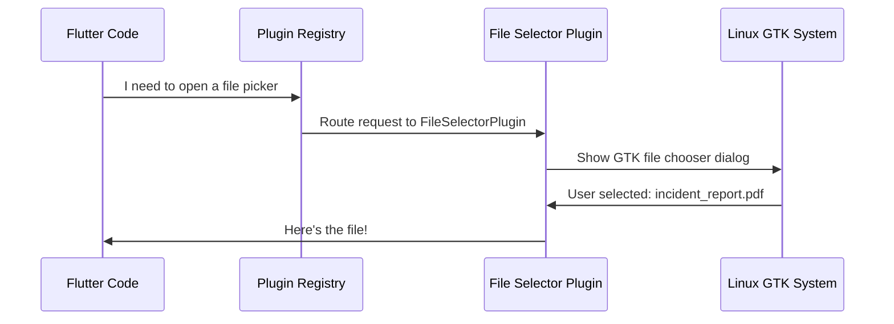
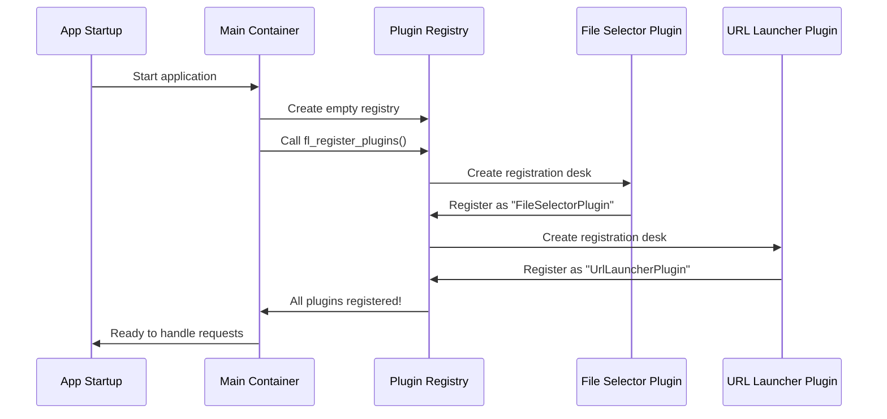
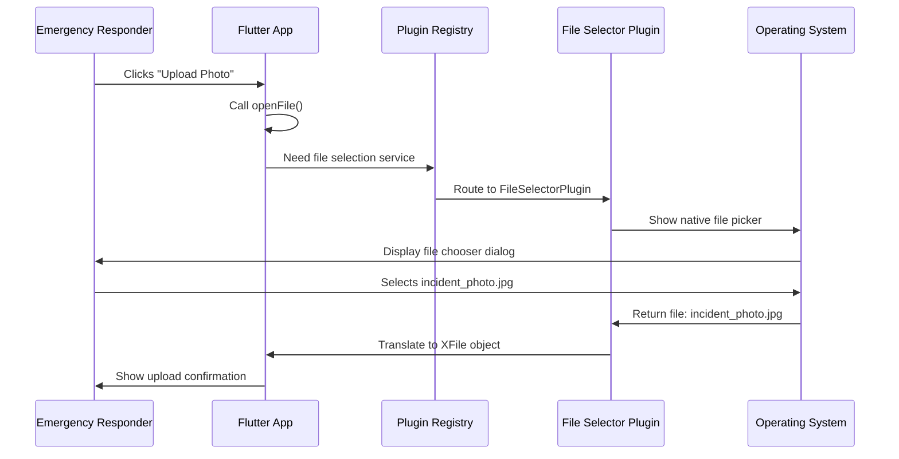

# Chapter 3: Plugin Registration System

Welcome back! In [Chapter 2: Platform Native Containers](02_platform_native_containers.md), we learned how Flutter uses different "wrapper" classes—like `FlutterWindow` for Windows and `MyApplication` for Linux—to create native windows that host your Flutter app. We saw how these containers act as picture frames that make your Flutter app fit properly on different operating systems.

But there's a piece of the puzzle we haven't explored yet: How does your Flutter app actually *use* native platform features? How can it open a file picker, launch a web browser, access the camera, or get GPS coordinates? After all, these features are deeply tied to the operating system—Windows file pickers work completely differently from Linux file pickers!

That's exactly what we'll explore in this chapter: the **Plugin Registration System**.

## The Problem: Flutter Needs to Talk to Native Features

**Central Use Case:** Imagine you're building our Public Safety Application. Emergency responders need to:

1. **Select incident photos** from their computer to upload to a report
2. **Open emergency protocol websites** in their default web browser
3. **Get their current GPS location** to mark incident sites
4. **Access the device camera** to take photos of emergency scenes

Here's the challenge: Flutter is designed to be cross-platform, running the same code on Windows, Linux, iOS, and Android. But each of these platforms has completely different ways of accessing files, opening browsers, and using hardware!

**Think of it like this:** Imagine you're a brilliant coordinator who speaks only "Flutter language," but you need to work with local specialists who each speak different languages:

- The **Windows File Specialist** only speaks "Win32 API"
- The **Linux File Specialist** only speaks "GTK"
- The **GPS Specialist** on Windows speaks differently than on Linux
- The **Camera Specialist** has different protocols on each device

You can't learn every specialist's language—that would take forever, and you'd have to rewrite all your coordination plans for each platform! What you need is a **universal translator hub** that:

1. Knows all the specialists available on this platform
2. Automatically translates your requests into the right native language
3. Translates the responses back to you in "Flutter language"

That's exactly what the **Plugin Registration System** does!

## What Is the Plugin Registration System?

The Plugin Registration System is like a universal phone directory combined with an automatic translation service. It:

1. **Maintains a registry** (phone book) of all available "translators" (plugins)
2. **Automatically connects** these translators when your app starts
3. **Routes requests** from your Flutter code to the right native specialist
4. **Handles responses** and translates them back to Flutter

**Key insight:** When you write Flutter code that says "open a file picker," you're not actually opening anything yourself. Instead:
- Your Flutter code sends a request to the registry
- The registry finds the right plugin (translator)
- The plugin translates your request to native platform commands
- The native platform does the actual work
- The plugin translates the result back to Flutter

Let's see how this works!

## Key Concept 1: Plugins Are Translators

A **plugin** is a specialized piece of code that knows how to:
- Understand Flutter's requests
- Translate them into native platform commands
- Communicate with the operating system
- Translate responses back to Flutter

**Analogy:** Think of a plugin like a bilingual translator at the United Nations:
- They understand what Flutter is asking for (in "Flutter language")
- They know how to express that request in the native platform's language
- They listen to the native platform's response
- They translate that response back to Flutter

Our Public Safety Application uses several plugins. Let's look at the two simplest ones:

### File Selector Plugin

This plugin handles file picking operations:

```cpp
#include <file_selector_linux/file_selector_plugin.h>
```

**What it does:**
- Flutter says: "I need the user to select a file"
- Plugin translates to Linux: "Show a GTK file chooser dialog"
- User selects a file
- Plugin translates the result back to Flutter: "Here's the file path and info"

**Real-world example:** An emergency responder clicks "Upload Incident Report." The file selector plugin shows a native file picker, the user selects their PDF report, and the plugin gives Flutter the file information—all seamlessly!

### URL Launcher Plugin

This plugin handles opening web links:

```cpp
#include <url_launcher_linux/url_launcher_plugin.h>
```

**What it does:**
- Flutter says: "Open this emergency protocol URL in the default browser"
- Plugin translates to Linux: "Launch the user's default web browser with this URL"
- The browser opens
- Plugin confirms back to Flutter: "Success! Browser launched"

**Real-world example:** A dispatcher clicks a link to the emergency procedures manual. The URL launcher plugin opens their Firefox or Chrome browser to that webpage.

## Key Concept 2: The Registry—The Phone Book

The **registry** is like a phone book that keeps track of all available plugins. When your app starts, each plugin "registers" itself by adding its name and contact information to this book.

**Analogy:** Imagine opening a new emergency response center. Before taking any emergency calls, you need to create a directory of all available specialists:

```
Emergency Response Center Directory
==================================
File Selection Specialist: Extension 101
URL Opening Specialist: Extension 102  
GPS Location Specialist: Extension 103
Camera Access Specialist: Extension 104
```

Once this directory is set up, when an emergency call comes in asking for GPS coordinates, you can quickly look up "GPS Location Specialist" and connect them to the caller.

Similarly, the plugin registry maintains a directory so Flutter can quickly find the right plugin for any request.

## Key Concept 3: Automatic Registration at Startup

The beautiful part? All this registration happens **automatically** when your app starts. You don't have to manually connect each plugin—the system does it for you!

Let's see how this works on Linux:

```cpp
void fl_register_plugins(FlPluginRegistry* registry) {
```

This function is called once when your app initializes. Its job is to register all the plugins.

**Registering the file selector:**

```cpp
g_autoptr(FlPluginRegistrar) file_selector_linux_registrar =
    fl_plugin_registry_get_registrar_for_plugin(
        registry, "FileSelectorPlugin");
file_selector_plugin_register_with_registrar(
    file_selector_linux_registrar);
```

Let's break this down:

**Line 1-3:** Ask the registry for a "registrar" (like a registration desk clerk) for the "FileSelectorPlugin"

**Line 4-5:** Tell the file selector plugin to register itself with that registrar

**Think of it like this:**
1. The registry creates a dedicated registration desk for file selection
2. The file selector plugin walks up to that desk
3. The plugin says: "My name is FileSelectorPlugin, and I handle file picking requests"
4. The registrar writes this down in the phone book

**Registering the URL launcher:**

```cpp
g_autoptr(FlPluginRegistrar) url_launcher_linux_registrar =
    fl_plugin_registry_get_registrar_for_plugin(
        registry, "UrlLauncherPlugin");
url_launcher_plugin_register_with_registrar(
    url_launcher_linux_registrar);
```

The exact same pattern! Each plugin gets its own registration desk and signs up.

After this function completes, the registry knows about both plugins and can route requests to them.

## How Flutter Uses Plugins: A User's Perspective

From your Flutter code's perspective, using plugins is incredibly simple. You don't see any of the registration machinery—you just make simple function calls!

**Example: Opening a file picker in Flutter**

```dart
import 'package:file_selector/file_selector.dart';

// User clicks "Select Incident Report"
final file = await openFile();
```

That's it! Two lines of code. But behind the scenes:



**Step-by-step:**
1. Your Flutter code calls `openFile()`
2. The registry looks up which plugin handles file selection
3. It routes the request to FileSelectorPlugin
4. The plugin translates to native Linux commands
5. Linux shows the file picker dialog
6. The user selects a file
7. The plugin receives the file information
8. The plugin translates it back to Flutter format
9. Your Flutter code receives the file!

All the complexity is hidden. You just write simple, readable Flutter code.

## Under the Hood: The Registration Process

Let's dive deeper into what happens when your app starts up and plugins register themselves.

### The Complete Registration Flow



**Detailed walkthrough:**

1. **App starts:** The user launches your Public Safety Application
2. **Container creation:** The main container (MyApplication on Linux, FlutterWindow on Windows) is created
3. **Empty registry:** A blank plugin registry is created—like an empty phone book
4. **Registration begins:** The system calls the registration function
5. **File plugin desk:** A registration desk is created for the file selector
6. **File plugin registers:** The file selector plugin adds its entry to the phone book
7. **URL plugin desk:** A registration desk is created for the URL launcher
8. **URL plugin registers:** The URL launcher plugin adds its entry
9. **Completion:** The registry now knows about all available plugins
10. **Ready state:** Your app is ready to handle any plugin-based requests!

### Looking at the Registration Code (Linux)

Let's examine the Linux registration file in detail. Here's the complete function:

```cpp
void fl_register_plugins(FlPluginRegistry* registry) {
```

This declares the registration function. It takes a `registry` parameter—the phone book where plugins will be registered.

**First plugin registration:**

```cpp
g_autoptr(FlPluginRegistrar) file_selector_linux_registrar =
    fl_plugin_registry_get_registrar_for_plugin(
        registry, "FileSelectorPlugin");
```

**What this does:**
- `g_autoptr` - Creates a "smart pointer" that automatically cleans up when done (like a self-destructing temporary ID badge)
- `fl_plugin_registry_get_registrar_for_plugin` - Asks the registry to create a registration desk for "FileSelectorPlugin"
- The result is stored in `file_selector_linux_registrar` - this is like the desk clerk who will handle the file selector plugin's registration

**Complete the registration:**

```cpp
file_selector_plugin_register_with_registrar(
    file_selector_linux_registrar);
```

This tells the file selector plugin: "Here's your registration desk—go sign up!" The plugin then provides all the information the registry needs to route requests to it.

**Second plugin registration:**

```cpp
g_autoptr(FlPluginRegistrar) url_launcher_linux_registrar =
    fl_plugin_registry_get_registrar_for_plugin(
        registry, "UrlLauncherPlugin");
url_launcher_plugin_register_with_registrar(
    url_launcher_linux_registrar);
```

The exact same pattern for the URL launcher! This consistency makes it easy to understand—every plugin follows the same registration process.

**End of function:**

```cpp
}
```

That's it! Once this function completes, both plugins are registered and ready to use.

## Looking at Windows Registration

The Windows version follows the same concept with slightly different syntax:

```cpp
void RegisterPlugins(flutter::PluginRegistry* registry) {
```

Notice the function name is `RegisterPlugins` (not `fl_register_plugins`) and the registry type is `flutter::PluginRegistry*` (not `FlPluginRegistry*`). This shows platform differences in naming conventions, but the concept is identical.

**Windows has more plugins:**

```cpp
CloudFirestorePluginCApiRegisterWithRegistrar(
    registry->GetRegistrarForPlugin("CloudFirestorePluginCApi"));
FileSelectorWindowsRegisterWithRegistrar(
    registry->GetRegistrarForPlugin("FileSelectorWindows"));
FirebaseAuthPluginCApiRegisterWithRegistrar(
    registry->GetRegistrarForPlugin("FirebaseAuthPluginCApi"));
```

**What's different?**

Windows has additional plugins like Firebase (for cloud database) and Geolocator (for GPS). But the registration pattern is the same:

1. Get a registrar for the plugin
2. Tell the plugin to register with that registrar

**Example breakdown:**

```cpp
FileSelectorWindowsRegisterWithRegistrar(
    registry->GetRegistrarForPlugin("FileSelectorWindows"));
```

**Translation to plain English:**
"Get the registration desk for the Windows file selector plugin, then tell the file selector to sign up at that desk."

## The Header Files: Making Functions Available

You might have noticed these files include "header" files:

**Linux header:**

```cpp
#ifndef GENERATED_PLUGIN_REGISTRANT_
#define GENERATED_PLUGIN_REGISTRANT_

#include <flutter_linux/flutter_linux.h>

void fl_register_plugins(FlPluginRegistry* registry);

#endif
```

**What's this doing?**

This is like a business card that says: "We have a registration service available! You can call `fl_register_plugins()` to set up all the plugins."

The `#ifndef` guards (like a protective envelope) ensure this declaration only gets included once, even if multiple files try to use it.

**Windows header:**

```cpp
#ifndef GENERATED_PLUGIN_REGISTRANT_
#define GENERATED_PLUGIN_REGISTRANT_

#include <flutter/plugin_registry.h>

void RegisterPlugins(flutter::PluginRegistry* registry);

#endif
```

Same concept, different function name! The header advertises the Windows registration function.

## Automatic Generation: Flutter Does the Work

Notice the comment at the top of these files:

```cpp
//  Generated file. Do not edit.
```

**What does this mean?**

These files are **automatically created** by Flutter! When you add a plugin to your `pubspec.yaml` file (Flutter's configuration file), Flutter automatically updates these registration files.

**Example scenario:**

1. You edit `pubspec.yaml` and add a new plugin:
   ```yaml
   dependencies:
     camera: ^0.10.0
   ```

2. You run `flutter pub get` to download the plugin

3. Flutter automatically updates the registration files to include the camera plugin:
   ```cpp
   CameraPluginRegisterWithRegistrar(
       registry->GetRegistrarForPlugin("CameraPlugin"));
   ```

**Analogy:** It's like having an assistant who automatically updates your emergency response directory every time you hire a new specialist. You just tell your assistant "We hired a camera technician," and they handle adding it to the phone book!

## Real-World Example: Emergency Incident Upload

Let's trace through a complete real-world scenario: An emergency responder wants to upload a photo of an incident.

### The Flutter Code (What You Write)

```dart
// Emergency responder clicks "Upload Photo"
import 'package:file_selector/file_selector.dart';

Future<void> uploadIncidentPhoto() async {
  final file = await openFile(
    acceptedTypeGroups: [
      XTypeGroup(
        label: 'images',
        extensions: ['jpg', 'png'],
      ),
    ],
  );
  
  if (file != null) {
    // Upload the file to cloud storage
    print('Selected: ${file.path}');
  }
}
```

**What this code does:**
- Opens a file picker that only shows image files (.jpg and .png)
- Waits for the user to select a file
- If a file is selected, prints its path (and would upload it in a real app)

### What Happens Behind the Scenes



**Step-by-step narration:**

1. **User action:** Emergency responder clicks the "Upload Photo" button in the app

2. **Flutter request:** The `openFile()` function is called with image type filters

3. **Registry lookup:** The file_selector package asks the registry: "Who handles file selection?"

4. **Plugin found:** The registry responds: "FileSelectorPlugin handles that"

5. **Request forwarded:** The request is sent to FileSelectorPlugin with the type filters

6. **Translation:** The plugin translates the Flutter request into native platform commands:
   - On Linux: "Show a GTK file chooser with image filters"
   - On Windows: "Show a Win32 file dialog with .jpg and .png filters"

7. **Native display:** The operating system shows its native file picker

8. **User selection:** The responder navigates to their photos folder and selects "incident_photo.jpg"

9. **Result capture:** The OS returns the selected file information to the plugin

10. **Translation back:** The plugin translates the native file information into a Flutter `XFile` object

11. **Flutter receives:** Your Flutter code receives the file and can now upload it

12. **User feedback:** The app shows a confirmation: "Photo selected successfully!"

All of this complexity—handled automatically by the plugin system!

## Adding More Plugins to Your App

As your Public Safety Application grows, you'll likely need additional plugins. Let's see how easy it is to add them.

### Adding a GPS Location Plugin

**Step 1: Add to pubspec.yaml**

```yaml
dependencies:
  geolocator: ^9.0.0
```

**Step 2: Run Flutter command**

```bash
flutter pub get
```

**Step 3: Flutter automatically updates registration files!**

The Windows registration file now includes:

```cpp
GeolocatorWindowsRegisterWithRegistrar(
    registry->GetRegistrarForPlugin("GeolocatorWindows"));
```

**Step 4: Use it in your Flutter code**

```dart
import 'package:geolocator/geolocator.dart';

Position position = await Geolocator.getCurrentPosition();
print('Incident location: ${position.latitude}, ${position.longitude}');
```

**You didn't have to:**
- Manually edit the registration files
- Write any platform-specific code
- Worry about Windows vs Linux differences

The plugin system handled everything automatically!

### Adding a Camera Plugin

Same process:

**Add to pubspec.yaml:**

```yaml
dependencies:
  camera: ^0.10.0
```

**Run flutter pub get, and the registration is automatic!**

Now you can take photos in your app:

```dart
import 'package:camera/camera.dart';

final cameras = await availableCameras();
final firstCamera = cameras.first;
// Use camera to take incident photos
```

## Why This Design Is Brilliant

The Plugin Registration System solves several major challenges:

### 1. Write Once, Run Everywhere

**Without plugins:**
```
❌ Write file picker code for Windows
❌ Write different file picker code for Linux  
❌ Write yet another version for iOS
❌ Maintain three different implementations
```

**With plugins:**
```
✅ Write openFile() once in Flutter
✅ Plugin system handles all platforms automatically
✅ One codebase to maintain
```

### 2. Automatic Setup

You don't manually wire up plugins—Flutter does it automatically based on your `pubspec.yaml`. This prevents errors and saves time.

### 3. Easy Extension

Need a new capability? Add one line to `pubspec.yaml`, run one command, and you're done. The registration updates automatically.

### 4. Platform Optimization

Each plugin can use the best native approach for its platform:
- Windows file picker uses Win32 API for perfect Windows integration
- Linux file picker uses GTK for perfect Linux integration
- But your Flutter code stays the same!

## Comparison: Linux vs Windows Registration

Let's compare the two platforms side-by-side:

| Aspect | Linux | Windows |
|--------|-------|---------|
| **Function name** | `fl_register_plugins()` | `RegisterPlugins()` |
| **Registry type** | `FlPluginRegistry*` | `flutter::PluginRegistry*` |
| **Registrar creation** | `fl_plugin_registry_get_registrar_for_plugin()` | `registry->GetRegistrarForPlugin()` |
| **Memory management** | `g_autoptr` (automatic) | Manual (handled by Flutter) |
| **Plugin count** | 2 (file, URL) | 8 (file, URL, Firebase, GPS, etc.) |

**Key insight:** Despite different syntax and conventions, both platforms follow the exact same pattern:
1. Get a registrar for a plugin
2. Tell the plugin to register with that registrar
3. Repeat for all plugins

This consistency makes the system easy to understand and maintain!

## Key Takeaways

Congratulations! You now understand how the Plugin Registration System works. Let's review what we learned:

1. **Plugins are translators** that convert between Flutter's cross-platform code and native platform-specific features

2. **The registry is a phone book** that keeps track of all available plugins so Flutter can route requests to the right one

3. **Registration happens automatically** at app startup—each plugin signs up with the registry

4. **Flutter generates the registration code** automatically based on your `pubspec.yaml` dependencies

5. **The same Flutter code works everywhere** because different platform-specific plugins handle the translation on each OS

6. **Adding new plugins is easy**—just add them to `pubspec.yaml` and Flutter updates the registration automatically

**The big picture:** The Plugin Registration System is the "universal translator hub" that lets your Flutter app seamlessly access native platform features. It acts like an international emergency response center with interpreters for every language, ensuring your Flutter coordinator can work with specialists on any platform without learning their native languages.

Whether you're opening files on Windows or Linux, launching URLs, accessing GPS, or using the camera, you write the same simple Flutter code. The plugin system handles all the complex platform-specific translation work behind the scenes!

## What's Next?

You've now completed the foundation! You understand:

- [Chapter 1: Application Entry Point and Initialization](01_application_entry_point_and_initialization.md) - How the app starts up and initializes
- [Chapter 2: Platform Native Containers](02_platform_native_containers.md) - How Flutter wraps itself in native windows for each platform
- **Chapter 3: Plugin Registration System** - How Flutter accesses native platform features through plugins

With this knowledge, you're ready to build sophisticated cross-platform applications that leverage the full power of each operating system while maintaining a single, maintainable Flutter codebase. Your Public Safety Application can now use file pickers, web browsers, GPS, cameras, and any other native feature you need—all through simple, readable Flutter code!

Keep building, and remember: the plugin system is there to make your life easier. Let it handle the complex platform-specific details while you focus on creating amazing user experiences for emergency responders!

