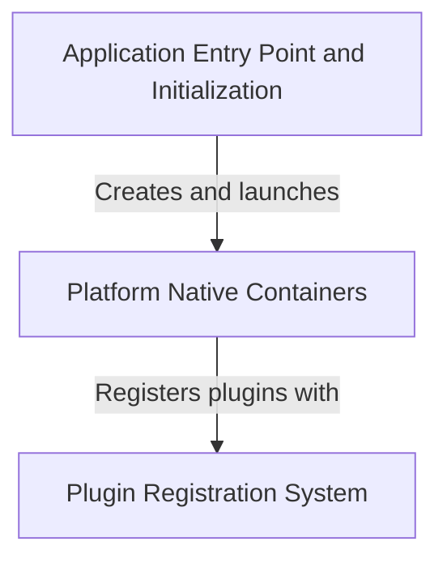

# Tutorial: Public_Safety_Application

The **Public Safety Application** is a *cross-platform Flutter app* designed to help emergency responders 
and coordinators manage safety incidents. The app runs on **Windows, Linux, and iOS** by wrapping the 
Flutter code in *platform-specific containers* that translate between Flutter's cross-platform language 
and each operating system's native requirements. It uses a **Plugin Registration System** to access 
*native device features* like file selection, web browsers, GPS, and cameras—allowing responders to 
upload incident reports, access emergency protocols, and coordinate responses. Each platform has its 
own **entry point and initialization sequence** that sets up the environment, creates the main window, 
and starts the application's message loop to keep it responsive to user interactions.

**Source Repository:** [https://github.com/pruthvirajt24/Public_Safety_Application](https://github.com/pruthvirajt24/Public_Safety_Application)

## Chapters

1. [Application Entry Point and Initialization](01_application_entry_point_and_initialization.md)
2. [Platform Native Containers](02_platform_native_containers.md)
3. [Plugin Registration System](03_plugin_registration_system.md)
