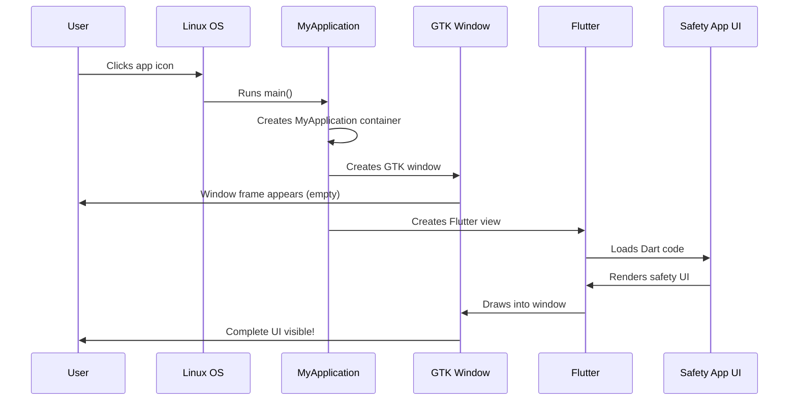
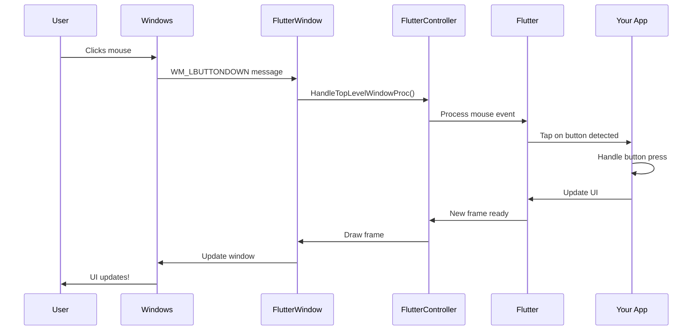

# Chapter 2: Platform-Specific Application Containers

Welcome back! In [Chapter 1: Application Entry Point and Lifecycle Management](01_application_entry_point_and_lifecycle_management.md), you learned how your Public Safety Application starts up—from the very first line of code that runs when you double-click the app icon, through initialization, and into the message loop that keeps the app responsive.

But we glossed over something important: **where does the actual window come from?** How does your Flutter UI actually appear on screen? And why does the same app look different on Windows versus Linux?

In this chapter, we'll explore the "containers" that wrap your Flutter app and make it work seamlessly on different operating systems!

## What Problem Do Platform-Specific Application Containers Solve?

Imagine you're a traveling art dealer with a beautiful painting (your Flutter app). You need to display this painting in different cities:
- In New York, galleries expect ornate golden frames
- In Tokyo, minimalist wooden frames are the standard
- In Paris, classic baroque frames are preferred

The painting is always the same, but the **frame** must match local expectations. If you show up in Tokyo with a baroque frame, it'll look out of place!

**The same challenge exists with software.** Your Flutter app is the "painting," but:
- **Windows** expects apps to have specific window decorations, title bars, and control buttons
- **Linux** (with GTK) has its own style of windows and menus
- Each operating system has different ways of handling events, managing windows, and displaying content

**Platform-Specific Application Containers** are those "frames"—they wrap your Flutter app in the appropriate native window for each platform.

### Our Use Case: Launching the Safety App

Let's use a concrete example. When an emergency dispatcher launches your Public Safety Application:

**On Windows:**
- They see a window with a Windows-style title bar
- The close, minimize, and maximize buttons look like Windows buttons
- Right-clicking the title bar shows a Windows-style menu
- The window frame follows the Windows theme (dark or light mode)

**On Linux:**
- They see a window with a GTK-style header bar
- The close button has the GTK style
- The window integrates with the Linux desktop environment
- It respects Linux theming and fonts

**The Flutter UI inside is identical**, but the container around it is different!

## Key Concept: What is a Container?

A **container** in this context is a native window that:
1. **Hosts** your Flutter app inside it
2. **Translates** between Flutter and the operating system
3. **Handles** platform-specific requirements (window decorations, events, etc.)

Think of it like this:

```
┌─────────────────────────────────┐
│  Windows/Linux Window Frame     │  ← Platform Container
│  ┌───────────────────────────┐  │
│  │                           │  │
│  │   Your Flutter App        │  │  ← Your actual UI
│  │   (Same on all platforms) │  │
│  │                           │  │
│  └───────────────────────────┘  │
└─────────────────────────────────┘
```

## The Two Container Types in Our Public Safety App

Our application uses two completely different containers:

### 1. Windows Container: FlutterWindow

On Windows, we use a class called `FlutterWindow` that creates a native Windows window:

```cpp
class FlutterWindow : public Win32Window {
  // Creates a Windows-style window
  explicit FlutterWindow(const flutter::DartProject& project);
};
```

**What this means:**
- `FlutterWindow` extends `Win32Window` (a basic Windows window)
- It takes a `DartProject` (your Flutter app configuration)
- It knows how to create Windows-style windows with proper title bars and borders

### 2. Linux Container: MyApplication

On Linux, we use a different approach with `MyApplication`:

```cpp
G_DECLARE_FINAL_TYPE(MyApplication, my_application, MY, APPLICATION,
                     GtkApplication)
```

**What this means:**
- `MyApplication` is based on `GtkApplication` (the Linux/GTK windowing system)
- It creates GTK-style windows that fit into Linux desktop environments
- It handles Linux-specific windowing behavior

**The key insight:** These are two completely different implementations, but they serve the same purpose—wrapping your Flutter app!

## How Containers Work: The Big Picture

Let's trace what happens when a user launches your safety app. We'll focus on Linux first since it's slightly simpler:



**Step-by-step breakdown:**

1. **User clicks the app icon** → Operating system starts the app
2. **MyApplication container created** → The Linux-specific wrapper initializes
3. **GTK window created** → A native Linux window appears (but empty)
4. **Flutter view created** → Flutter engine starts inside the window
5. **Dart code loads** → Your safety app logic runs
6. **UI renders** → Flutter draws the emergency buttons, maps, etc.
7. **User sees complete app** → The window now shows the full safety interface!

## Deep Dive: The Linux Container (MyApplication)

Let's look at how the Linux container actually works. When the app activates, the `my_application_activate` function runs:

### Step 1: Creating the Window

```cpp
GtkWindow* window =
    GTK_WINDOW(gtk_application_window_new(GTK_APPLICATION(application)));
```

**What this does:**
- Creates a new GTK window
- This is a native Linux window that the operating system manages
- At this point, the window exists but isn't visible yet

**Analogy:** We've constructed the picture frame, but haven't hung it on the wall or put the painting in yet.

### Step 2: Setting Up the Title Bar

```cpp
GtkHeaderBar* header_bar = GTK_HEADER_BAR(gtk_header_bar_new());
gtk_header_bar_set_title(header_bar, "women_safety_app");
gtk_window_set_titlebar(window, GTK_WIDGET(header_bar));
```

**What this does:**
- Creates a GTK header bar (the top part of the window)
- Sets the window title to "women_safety_app"
- Attaches the header bar to the window

**Result:** The window now has a proper title bar with your app's name!

### Step 3: Setting Window Size

```cpp
gtk_window_set_default_size(window, 1280, 720);
gtk_widget_show(GTK_WIDGET(window));
```

**What this does:**
- Sets the window to 1280 pixels wide by 720 pixels tall
- Makes the window visible on screen

**At this point:** You'd see an empty window with the title "women_safety_app"!

### Step 4: Creating the Flutter View

```cpp
FlView* view = fl_view_new(project);
gtk_widget_show(GTK_WIDGET(view));
gtk_container_add(GTK_CONTAINER(window), GTK_WIDGET(view));
```

**What this does:**
- `fl_view_new(project)` creates a Flutter view (where Flutter will draw)
- Makes the view visible
- Adds the view **inside** the window container

**Analogy:** We've placed the painting (Flutter view) inside the frame (GTK window)!

### Step 5: Registering Plugins

```cpp
fl_register_plugins(FL_PLUGIN_REGISTRY(view));
```

**What this does:**
- Registers Flutter plugins (like camera access, geolocation, etc.)
- Plugins need to know about the view so they can interact with the platform

**Why it matters:** Without this, your app couldn't access the camera for emergency photos or GPS for location tracking!

### Complete Linux Activation Flow

Here's what happens from start to finish:

```cpp
static void my_application_activate(GApplication* application) {
  // 1. Create GTK window
  GtkWindow* window = GTK_WINDOW(gtk_application_window_new(...));
  
  // 2. Set up header bar
  GtkHeaderBar* header_bar = GTK_HEADER_BAR(gtk_header_bar_new());
  gtk_window_set_titlebar(window, GTK_WIDGET(header_bar));
  
  // 3. Size and show window
  gtk_window_set_default_size(window, 1280, 720);
  gtk_widget_show(GTK_WIDGET(window));
  
  // 4. Create Flutter view
  FlView* view = fl_view_new(project);
  gtk_container_add(GTK_CONTAINER(window), GTK_WIDGET(view));
  
  // 5. Register plugins
  fl_register_plugins(FL_PLUGIN_REGISTRY(view));
}
```

**The result:** A complete, running Linux window with Flutter inside!

## Deep Dive: The Windows Container (FlutterWindow)

Now let's look at the Windows side. The Windows container is slightly more complex because Windows requires more setup. The magic happens in `FlutterWindow::OnCreate()`:

### Step 1: Create the Basic Window

```cpp
bool FlutterWindow::OnCreate() {
  if (!Win32Window::OnCreate()) {
    return false;
  }
  // ... more setup ...
}
```

**What this does:**
- Calls the parent class to create a basic Windows window
- This creates the window frame, title bar, and standard controls
- Returns `false` if window creation fails

### Step 2: Get Window Dimensions

```cpp
RECT frame = GetClientArea();
```

**What this does:**
- Gets the size of the window's content area (where we can draw)
- This excludes the title bar and window borders

**Example:** If your window is 1280x720 total, the client area might be 1280x680 (accounting for the title bar).

### Step 3: Create Flutter Controller

```cpp
flutter_controller_ = std::make_unique<flutter::FlutterViewController>(
    frame.right - frame.left,
    frame.bottom - frame.top,
    project_);
```

**What this does:**
- Creates a `FlutterViewController`—the bridge between Windows and Flutter
- Passes the window dimensions so Flutter knows how much space it has
- Passes the project configuration (where to find your app's code and assets)

**Analogy:** This is like hiring a translator who speaks both Windows and Flutter!

### Step 4: Verify Initialization

```cpp
if (!flutter_controller_->engine() || !flutter_controller_->view()) {
  return false;
}
```

**What this does:**
- Checks that the Flutter engine started successfully
- Checks that the Flutter view was created
- Returns `false` if either failed

**Why this matters:** If Flutter can't start, there's no point continuing—better to fail gracefully!

### Step 5: Register Plugins

```cpp
RegisterPlugins(flutter_controller_->engine());
```

**What this does:**
- Registers all Flutter plugins with the engine
- This enables your app to use native Windows features

You'll learn more about this in [Chapter 3: Plugin Registration System](03_plugin_registration_system.md)!

### Step 6: Embed Flutter View

```cpp
SetChildContent(flutter_controller_->view()->GetNativeWindow());
```

**What this does:**
- Gets the native Windows window handle from Flutter
- Embeds it as a child inside our FlutterWindow
- Now Flutter can draw directly to the screen!

### Step 7: Smart Window Display

```cpp
flutter_controller_->engine()->SetNextFrameCallback([&]() {
  this->Show();
});
```

**What this does:**
- Tells Flutter: "After you render your first frame, call this function"
- The function (`this->Show()`) makes the window visible
- This prevents showing an empty window before Flutter is ready!

**Why this is clever:** Without this, users would see a blank white window for a split second. With this callback, the window only appears when Flutter has drawn the UI!

### Step 8: Force Initial Render

```cpp
flutter_controller_->ForceRedraw();
```

**What this does:**
- Ensures Flutter draws at least one frame
- Sometimes the first frame completes before we set up the callback
- This guarantees the callback gets triggered

## Comparing Windows and Linux Containers

Let's see the key differences side-by-side:

| Aspect | Windows (FlutterWindow) | Linux (MyApplication) |
|--------|-------------------------|----------------------|
| **Base Class** | Win32Window | GtkApplication |
| **Window Creation** | Manual Win32 API calls | GTK helper functions |
| **Title Bar** | Standard Windows title bar | GTK header bar |
| **Flutter Setup** | FlutterViewController | FlView |
| **Visibility** | Delayed (callback) | Immediate |
| **Theme** | Windows theme detection | GTK theme system |

**The common pattern:**
1. Create native window
2. Configure appearance
3. Create Flutter view
4. Embed view in window
5. Register plugins
6. Show window

**The implementation details differ**, but the concept is identical!

## How Messages Flow Through the Container

Once the window is visible, it needs to respond to user actions. Let's see how a mouse click travels through the Windows container:



Here's the code that makes this happen:

```cpp
LRESULT FlutterWindow::MessageHandler(HWND hwnd, UINT message,
                                     WPARAM wparam, LPARAM lparam) {
  if (flutter_controller_) {
    std::optional<LRESULT> result =
        flutter_controller_->HandleTopLevelWindowProc(hwnd, message, 
                                                      wparam, lparam);
    if (result) {
      return *result;  // Flutter handled it!
    }
  }
  // Flutter didn't handle it, pass to default handler
  return Win32Window::MessageHandler(hwnd, message, wparam, lparam);
}
```

**What this does:**
1. **Receive Windows message** (like a mouse click)
2. **Give Flutter first chance** to handle it via `HandleTopLevelWindowProc()`
3. **If Flutter handled it**, return the result (we're done!)
4. **If Flutter didn't handle it**, pass to the parent class for default handling

**Example:** When a user clicks an emergency button in your app:
- Windows sends a click message
- FlutterWindow receives it
- Passes to FlutterController
- Flutter processes the click
- Your Dart code's `onPressed` callback runs
- The UI updates (maybe shows "Emergency Called!")

### Special Case: System Font Changes

```cpp
switch (message) {
  case WM_FONTCHANGE:
    flutter_controller_->engine()->ReloadSystemFonts();
    break;
}
```

**What this does:**
- When Windows notifies us that system fonts changed
- We tell Flutter to reload its font cache
- This ensures text displays correctly with new fonts

**Example:** User installs a new font → Windows notifies our app → Flutter reloads fonts → Your app's text still looks correct!

## Under the Hood: Window Lifecycle

Let's trace the complete lifecycle of a FlutterWindow from creation to destruction:

### Creation Phase

```cpp
// In main.cpp:
FlutterWindow window(project);  // 1. Constructor stores project
window.Create(L"women_safety_app", origin, size);  // 2. Create called
```

**What happens:**

1. **Constructor** stores the Flutter project configuration
2. **Create()** initiates window creation:
   - Win32Window creates the native Windows window
   - OnCreate() is called (our custom setup)
   - Flutter controller is created
   - Flutter view is embedded
   - Callback set for first frame
   - Window waits to be shown

### Running Phase

```cpp
// Window is visible and running
// Message loop processes events
while (::GetMessage(&msg, nullptr, 0, 0)) {
  // Each event goes to MessageHandler
}
```

**During this phase:**
- User interacts with the app
- Windows sends messages
- FlutterWindow routes them to Flutter
- Flutter updates the UI
- Changes appear on screen

### Destruction Phase

```cpp
void FlutterWindow::OnDestroy() {
  if (flutter_controller_) {
    flutter_controller_ = nullptr;  // Destroy Flutter first
  }
  Win32Window::OnDestroy();  // Then destroy window
}
```

**What happens:**

1. **User closes window** (clicks X button)
2. **OnDestroy() called** by Windows
3. **Flutter controller destroyed** (engine shuts down gracefully)
4. **Native window destroyed** (window disappears)

**Order matters!** We must destroy the Flutter controller **before** the window, because Flutter needs the window while shutting down.

## Why This Design Matters for Your Safety App

Understanding containers helps you appreciate why your app:

### 1. Looks Native Everywhere

**Without containers:**
```
Your app looks like a generic box on every platform
Users think: "This doesn't belong on my system"
```

**With containers:**
```
Windows users see a Windows app
Linux users see a Linux app
Both feel "at home" with the interface
```

### 2. Handles Platform Events Correctly

**Example:** Emergency dispatcher uses keyboard shortcut

- **Windows**: Ctrl+E triggers emergency alert
- **Linux**: Ctrl+E triggers the same alert
- **The container** translates the different platform event formats into a single format Flutter understands

### 3. Integrates with OS Features

**Windows container enables:**
- Dark mode support (reads Windows theme)
- High DPI scaling (crisp on 4K monitors)
- Touch screen support (for tablets)

**Linux container enables:**
- GTK theme integration
- Desktop environment compatibility
- Wayland/X11 support

### 4. Provides Clean Separation

```
┌─────────────────────────────────────┐
│  Platform Container                 │  ← Handles OS stuff
│  ┌───────────────────────────────┐  │
│  │  Flutter Engine               │  │  ← Handles rendering
│  │  ┌─────────────────────────┐  │  │
│  │  │  Your Dart Code         │  │  │  ← Your app logic
│  │  │  (Pure business logic)  │  │  │
│  │  └─────────────────────────┘  │  │
│  └───────────────────────────────┘  │
└─────────────────────────────────────┘
```

**Benefit:** You write your safety app logic in Dart, and it works on all platforms. The container handles platform differences!

## Real-World Example: Emergency Alert Dialog

Let's see how containers make your app work seamlessly:

**Your Dart code (same on all platforms):**
```dart
showDialog(
  context: context,
  builder: (context) => AlertDialog(
    title: Text('Emergency Alert Sent'),
    content: Text('Response team notified'),
  ),
);
```

**What the container does differently:**

**On Windows:**
- Translates to Win32 message box style
- Uses Windows notification sounds
- Respects Windows accessibility settings
- Handles Windows keyboard navigation

**On Linux:**
- Translates to GTK dialog style
- Uses GTK notification sounds
- Respects GTK accessibility settings
- Handles GTK keyboard navigation

**You write it once**, the container adapts it!

## Key Takeaways

In this chapter, you learned:

- **Platform-Specific Application Containers** are the native "frames" that hold your Flutter app on different operating systems
- **On Windows**, FlutterWindow wraps your app in a Win32 window with Windows-style decorations
- **On Linux**, MyApplication wraps your app in a GTK window with Linux-style decorations
- **Containers handle platform differences** so your Flutter code can remain the same
- **The lifecycle involves** creating the native window, embedding Flutter, registering plugins, and showing the UI
- **Message handling** routes user interactions from the OS to Flutter and back
- **Proper cleanup** ensures resources are released when the app closes

Think of containers as **translators** that speak both the language of your operating system and the language of Flutter. They ensure your beautiful Flutter app looks and behaves like a native application on each platform!

## What's Next?

Now that you understand how platform containers wrap your Flutter app and provide the native window, you might wonder: how does Flutter access native platform features like cameras, GPS, and storage?

That's where plugins come in! In the next chapter, [Chapter 3: Plugin Registration System](03_plugin_registration_system.md), you'll learn how Flutter plugins bridge the gap between your Dart code and native platform capabilities. You'll see how the containers we just learned about work together with the plugin system to give your safety app access to critical device features like emergency location tracking and instant photo capture!

