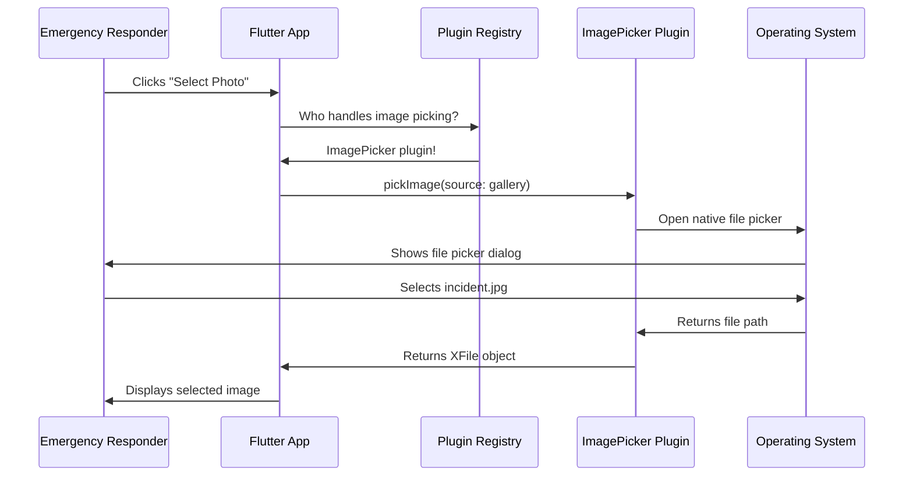
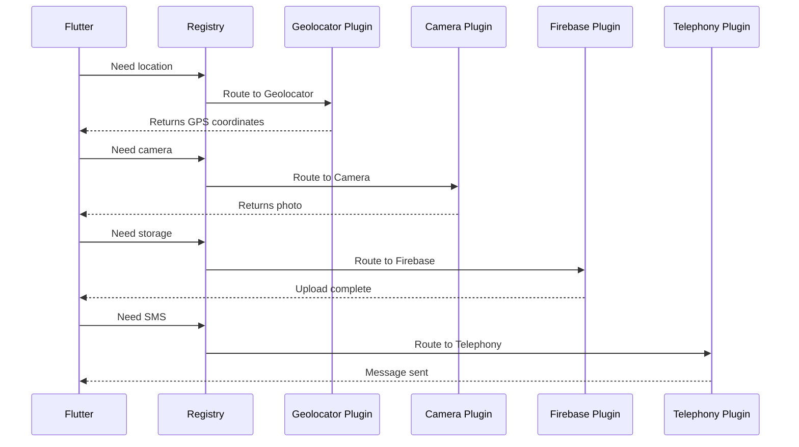

# Chapter 3: Plugin Registration System

Welcome back! In [Chapter 2: Platform-Specific Application Containers](02_platform_specific_application_containers.md), you learned how your Flutter app lives inside platform-specific windows—`FlutterWindow` on Windows and `MyApplication` on Linux. These containers provide the frame for your app to display its beautiful user interface.

But there's a challenge: your Public Safety Application needs to do more than just display pretty buttons and text. Emergency responders need to:
- Access the device's **camera** to document incidents
- Use **GPS location** to track emergency situations
- Send **SMS messages** for emergency alerts
- Pick **files** from the device to upload reports
- Open **web URLs** to view emergency protocols

Here's the problem: **Flutter can't directly talk to these native device features!**

## The Language Barrier Problem

Imagine you're an emergency coordinator who speaks only "Flutter language," but you need to ask the operating system (which speaks "Windows language" or "Linux language") to access the camera. You're facing a language barrier!

**Analogy:** Think of it like this:

```
You (Flutter): "I need to access the camera!"
Windows: "Was sagst du?" (What are you saying?)
Linux: "¿Qué?" (What?)
```

Flutter and the operating system literally speak different languages. Flutter uses Dart code, while Windows uses Win32 API and Linux uses GTK/native C APIs. They can't understand each other directly!

## The Solution: Plugin Translators

This is where the **Plugin Registration System** comes to the rescue! Think of plugins as professional translators who are fluent in both "Flutter language" and "native platform language."

**The Plugin Registration System is like a universal translator service** that:
1. Hires specialized translators (plugins) at startup
2. Keeps a directory of which translator handles which requests
3. Automatically routes your requests to the right translator

Let's see how this works!

## Breaking It Down: Key Concepts

### Concept 1: What is a Plugin?

A **plugin** is a piece of code that bridges Flutter and native platform features. Each plugin is specialized—it knows how to translate one specific type of request.

**Example plugins in your safety app:**

- **`camera` plugin**: Translates "take a photo" from Flutter into native camera commands
- **`geolocator` plugin**: Translates "get my location" into GPS API calls  
- **`url_launcher` plugin**: Translates "open this website" into browser launching
- **`image_picker` plugin**: Translates "pick an image" into native file picker

**Analogy:** It's like having specialized interpreters at the UN:
- One interpreter handles medical terminology (camera plugin)
- Another handles legal terms (location plugin)
- Each is an expert in their domain

### Concept 2: What is Plugin Registration?

**Plugin registration** is the process of introducing each plugin to Flutter when your app starts up. It's like the first day at a new emergency response center—everyone introduces themselves and explains what they can do.

**What happens during registration:**

1. Your app starts
2. Each plugin "checks in" and says: "I'm the camera plugin, call me when you need camera access"
3. Flutter creates a registry (like a phone book) of all available plugins
4. When Flutter needs a feature, it looks up the right plugin in the registry

### Concept 3: The Plugin Registry

The **plugin registry** is like a phone directory that maps requests to the right plugin.

**Think of it like:**

```
📞 Emergency Dispatch Registry
- Need camera? → Call camera plugin
- Need location? → Call geolocator plugin  
- Need to send SMS? → Call telephony plugin
- Need to open URL? → Call url_launcher plugin
```

## The Use Case: Opening a File Picker

Let's follow a concrete example: An emergency responder needs to upload an incident photo report by selecting a file from their device.

**In your Flutter/Dart code, it's beautifully simple:**

```dart
import 'package:image_picker/image_picker.dart';

final ImagePicker picker = ImagePicker();
final XFile? image = await picker.pickImage(
  source: ImageSource.gallery
);
```

That's it! Just three lines. But behind the scenes, the plugin registration system orchestrates a complex dance.

## How Registration Happens: The Code

When your app starts, it automatically registers all the plugins you've declared in your `pubspec.yaml` file. Let's see how this works on both platforms.

### Linux Plugin Registration

Here's the registration code for Linux (`linux/flutter/generated_plugin_registrant.cc`):

```cpp
#include <file_selector_linux/file_selector_plugin.h>
#include <url_launcher_linux/url_launcher_plugin.h>
```

**What this does:** These lines import the plugin translators. Each `#include` statement brings in a plugin that knows how to bridge Flutter and Linux.

Now here's the registration function:

```cpp
void fl_register_plugins(FlPluginRegistry* registry) {
  g_autoptr(FlPluginRegistrar) file_selector_registrar =
      fl_plugin_registry_get_registrar_for_plugin(
          registry, "FileSelectorPlugin");
  file_selector_plugin_register_with_registrar(
      file_selector_registrar);
```

**Breaking it down:**

1. **`fl_register_plugins(FlPluginRegistry* registry)`**: This is the main registration function. The `registry` is like the emergency dispatch phone book
2. **`fl_plugin_registry_get_registrar_for_plugin(registry, "FileSelectorPlugin")`**: This creates a registration entry for the file selector plugin—like adding a new contact to your phone
3. **`file_selector_plugin_register_with_registrar(file_selector_registrar)`**: This officially registers the plugin, so Flutter can find it later

**Analogy:** Imagine you're setting up an emergency hotline directory:
- Step 1: Open the directory book (the registry)
- Step 2: Create a new entry labeled "File Selection Emergency" 
- Step 3: Write down the phone number for the file selector specialist

The same pattern repeats for each plugin:

```cpp
  g_autoptr(FlPluginRegistrar) url_launcher_registrar =
      fl_plugin_registry_get_registrar_for_plugin(
          registry, "UrlLauncherPlugin");
  url_launcher_plugin_register_with_registrar(
      url_launcher_registrar);
}
```

### Windows Plugin Registration

The Windows version is very similar but uses Windows conventions (`windows/flutter/generated_plugin_registrant.cc`):

```cpp
#include <firebase_auth/firebase_auth_plugin_c_api.h>
#include <geolocator_windows/geolocator_windows.h>
#include <url_launcher_windows/url_launcher_windows.h>
```

**What this does:** Imports the Windows-specific versions of plugins.

The registration function:

```cpp
void RegisterPlugins(flutter::PluginRegistry* registry) {
  FirebaseAuthPluginCApiRegisterWithRegistrar(
      registry->GetRegistrarForPlugin("FirebaseAuthPluginCApi"));
      
  GeolocatorWindowsRegisterWithRegistrar(
      registry->GetRegistrarForPlugin("GeolocatorWindows"));
```

**Notice the differences:**

- Linux uses `fl_register_plugins`, Windows uses `RegisterPlugins`
- Linux uses GTK conventions, Windows uses Win32 conventions
- **But the concept is identical**: Register each plugin so Flutter can find it!

**The beauty of this system:** You write the same Flutter code on both platforms, and the appropriate plugin translates it for that specific operating system!

## The Complete Flow: From Flutter to Native and Back

Let's trace exactly what happens when an emergency responder clicks "Select Incident Photo" in your app:



**Step-by-step breakdown:**

1. **User action**: Emergency responder clicks "Select Incident Photo" button
2. **Flutter checks registry**: "I need to pick an image, who can help?"
3. **Registry responds**: "The ImagePicker plugin handles that!"
4. **Flutter calls plugin**: Sends `pickImage(source: gallery)` request
5. **Plugin translates**: Converts Flutter request into native OS commands
6. **OS responds**: Opens the native file picker (looks different on Windows vs Linux!)
7. **User selects file**: Chooses `incident_photo_2026_09_29.jpg`
8. **OS returns path**: Sends the file location back to the plugin
9. **Plugin translates back**: Converts native response into Flutter's `XFile` format
10. **Flutter receives result**: Gets the file and can now display or upload it!

## Under the Hood: How the Registry Works

Let's dive deeper into what happens inside the plugin registry.

### The Registry Data Structure

Think of the registry as a hash map (dictionary) that stores plugin information:

```
Registry = {
  "ImagePickerPlugin": <pointer to image picker>,
  "GeolocatorPlugin": <pointer to geolocator>,
  "CameraPlugin": <pointer to camera>,
  "UrlLauncherPlugin": <pointer to url launcher>,
  ...
}
```

When Flutter needs a feature, it:
1. Looks up the plugin name in this map
2. Gets the pointer to the plugin
3. Calls the plugin's method
4. Receives the translated response

### Registration Timing: When Does It Happen?

Remember from [Chapter 1: Application Entry Point and Lifecycle Management](01_application_entry_point_and_lifecycle_management.md) that your app has a specific startup sequence. Plugin registration happens **right after** the Flutter engine initializes but **before** your Flutter UI starts rendering.

**On Linux** (from `linux/my_application.cc`):

```cpp
// Create Flutter view
FlView* view = fl_view_new(project);

// Register plugins RIGHT AFTER creating the view
fl_register_plugins(FL_PLUGIN_REGISTRY(view));
```

**On Windows** (from `windows/flutter_window.cpp`):

```cpp
// Create Flutter controller
flutter_controller_ = std::make_unique<flutter::FlutterViewController>(
    frame.right - frame.left,
    frame.bottom - frame.top,
    project_);

// Register plugins immediately
RegisterPlugins(flutter_controller_->engine());
```

**Why this timing matters:**

- **Too early**: Flutter engine isn't ready yet, plugins have nowhere to attach
- **Too late**: Your Flutter UI tries to use plugins that aren't registered yet, causing crashes
- **Just right**: Plugins are ready exactly when Flutter needs them!

**Analogy:** It's like setting up emergency response teams:
- You can't assign teams before the dispatch center exists (too early)
- You can't wait until an emergency happens to assign teams (too late)  
- You assign teams right after opening the dispatch center (just right!)

## Generated Files: Flutter's Automatic Plugin Management

Notice that both registration files have this comment at the top:

```cpp
//  Generated file. Do not edit.
```

**What does "generated" mean?**

Flutter automatically creates these files based on your `pubspec.yaml` dependencies! Every time you run `flutter pub get`, Flutter:

1. Reads your `pubspec.yaml` to see which plugins you need
2. Generates the appropriate registration code for each platform
3. Creates the `generated_plugin_registrant.cc` and `.h` files

**Your `pubspec.yaml` dependencies:**

```yaml
dependencies:
  camera: ^0.11.0+1
  geolocator: ^10.0.0
  image_picker: ^1.0.4
  url_launcher: ^6.1.12
  firebase_auth: ^4.7.3
  # ... and many more
```

**Flutter automatically generates registration for all of these!**

**Why is this powerful?**

- You just add a plugin to `pubspec.yaml`
- Flutter handles all the complex registration code
- You never have to manually wire up plugins
- It works across all platforms automatically

## A Real Example: Multiple Plugins Working Together

In your safety app, emergency responders might need to:
1. Get their current GPS location (geolocator plugin)
2. Take a photo of an incident (camera plugin)
3. Upload the photo to Firebase (firebase_storage plugin)
4. Send an SMS alert (telephony plugin)

**All of this works because of plugin registration!**

Here's simplified Flutter code that uses multiple plugins:

```dart
// Get location
Position position = await Geolocator.getCurrentPosition();

// Take photo  
final XFile? photo = await picker.pickImage(source: ImageSource.camera);

// Upload to storage
await FirebaseStorage.instance.ref('incidents/${uuid()}').putFile(photo);

// Send SMS alert
await Telephony.instance.sendSms(
  to: emergencyContact,
  message: "Emergency at ${position.latitude}, ${position.longitude}"
);
```

**Behind the scenes:**



**Each plugin:**
- Was registered at startup
- Lives in the registry
- Gets called when needed
- Translates between Flutter and native code
- Returns results back to Flutter

**And you wrote just 10 lines of Flutter code!** The plugin registration system handled all the complexity.

## Platform Differences: Same Concept, Different Implementation

Let's compare how plugin registration differs between platforms:

| Aspect | Linux | Windows |
|--------|-------|---------|
| **Function Name** | `fl_register_plugins` | `RegisterPlugins` |
| **Registry Type** | `FlPluginRegistry*` | `flutter::PluginRegistry*` |
| **Naming Convention** | GTK style (underscores) | Win32 style (CamelCase) |
| **Include Pattern** | `<plugin_linux/plugin.h>` | `<plugin_windows/plugin.h>` |
| **Registrar Creation** | `g_autoptr` (GLib memory management) | Direct function calls |

**But the process is identical:**

1. Import the plugin
2. Get a registrar for the plugin
3. Register the plugin with the registrar
4. Repeat for each plugin

**This is the power of abstraction!** The plugin registration **concept** is universal, even though the implementation details vary by platform.

## Common Plugins in Your Safety App

Let's look at some key plugins your app uses and what they do:

### Location & Navigation
```cpp
#include <geolocator_windows/geolocator_windows.h>
```
**What it does:** Accesses GPS, WiFi triangulation, and cell tower location services to track emergency responder positions and incident locations.

### File Access
```cpp
#include <file_selector_windows/file_selector_windows.h>
```
**What it does:** Opens native file picker dialogs so responders can select incident photos, documents, and reports to upload.

### Web Integration  
```cpp
#include <url_launcher_windows/url_launcher_windows.h>
```
**What it does:** Opens web browsers to view emergency protocols, maps, and external resources.

### Firebase Services
```cpp
#include <firebase_auth/firebase_auth_plugin_c_api.h>
#include <firebase_storage/firebase_storage_plugin_c_api.h>
```
**What it does:** Handles user authentication and cloud storage for incident reports and photos.

**Each plugin:**
- Bridges a specific native capability
- Registers itself at startup
- Waits to be called by Flutter
- Translates requests and responses

## What Happens If Registration Fails?

Plugin registration is critical. If it fails, your app can't access native features. Let's understand the failure modes:

### Scenario 1: Plugin Not Found

If a plugin isn't properly registered:

```dart
// In your Flutter code
await Geolocator.getCurrentPosition();
```

**Result:** You'll see an error like:

```
MissingPluginException(No implementation found for method getCurrentPosition)
```

**What this means:** Flutter looked in the registry but couldn't find the geolocator plugin. Either:
- It wasn't included in `pubspec.yaml`
- Registration code wasn't generated
- Registration function wasn't called at startup

### Scenario 2: Wrong Platform Plugin

If you accidentally register the wrong platform's plugin (e.g., Android plugin on Windows):

**Result:** Compilation error! The C++ compiler will complain that it can't find the Android-specific headers.

**Why this doesn't happen:** Flutter's build system automatically generates the correct registration for each platform. You can't accidentally mix them up.

### Scenario 3: Registration Called Too Late

If registration happens after Flutter tries to use a plugin:

**Result:** The same `MissingPluginException` error, because Flutter checked the registry before the plugin was added.

**Why this doesn't happen:** As we saw earlier, registration is carefully timed to happen right after the Flutter engine initializes.

## The Header Files: Declaration vs Implementation

Let's quickly understand the `.h` (header) files:

**Linux header (`generated_plugin_registrant.h`):**

```cpp
#ifndef GENERATED_PLUGIN_REGISTRANT_
#define GENERATED_PLUGIN_REGISTRANT_

#include <flutter_linux/flutter_linux.h>

void fl_register_plugins(FlPluginRegistry* registry);

#endif  // GENERATED_PLUGIN_REGISTRANT_
```

**What this does:**

1. **Include guard** (`#ifndef`): Prevents this header from being included multiple times
2. **Include Flutter headers**: Brings in necessary Flutter types
3. **Function declaration**: Tells other code "this function exists, you can call it"

**The implementation** (what the function actually does) lives in the `.cc` file we saw earlier.

**Why separate declaration and implementation?**

- Other parts of your app can `#include` this header to call `fl_register_plugins()`
- They don't need to see the implementation details
- The implementation can change without affecting other code

**Analogy:** The header is like a restaurant menu (tells you what's available), and the implementation is like the kitchen (does the actual cooking).

## Summary: The Universal Translator

Let's recap what we've learned about the Plugin Registration System:

**The Problem:**
- Flutter apps need to access native device features (camera, GPS, file system, etc.)
- Flutter can't directly talk to operating systems—they speak different languages

**The Solution:**
- Plugins act as specialized translators between Flutter and native code
- Each plugin handles one type of feature (location, camera, files, etc.)
- The Plugin Registration System sets up all these translators at app startup

**How It Works:**
1. At startup, the registration function is called
2. Each plugin "checks in" with the registry
3. Flutter creates a directory mapping features to plugins
4. When Flutter needs a feature, it looks up the right plugin
5. The plugin translates the request to native code
6. The OS responds, and the plugin translates back to Flutter
7. Your Flutter code gets the result!

**Why It Matters:**
- You write simple Flutter code that works on all platforms
- The registration system handles all the complex platform differences
- Adding new capabilities is as easy as adding a line to `pubspec.yaml`
- Flutter automatically generates the registration code

**The Beautiful Result:**

You can write clean, simple Flutter code like this:

```dart
final photo = await ImagePicker().pickImage(source: ImageSource.camera);
final position = await Geolocator.getCurrentPosition();
await FirebaseStorage.instance.ref('incident').putFile(photo);
```

And it just works—on Windows, Linux, Android, and iOS—because the Plugin Registration System orchestrates all the complex native interactions behind the scenes!

## Wrapping Up: The Complete Picture

Congratulations! You've now completed all three foundational chapters:

1. **[Chapter 1: Application Entry Point and Lifecycle Management](01_application_entry_point_and_lifecycle_management.md)**: You learned how your app starts, runs its event loop, and gracefully shuts down.

2. **[Chapter 2: Platform-Specific Application Containers](02_platform_specific_application_containers.md)**: You discovered how platform-specific containers (`FlutterWindow` on Windows, `MyApplication` on Linux) wrap your Flutter app in native windows.

3. **Chapter 3: Plugin Registration System** (this chapter): You explored how plugins bridge the gap between Flutter and native device features, and how the registration system sets up these translators.

**Together, these three systems work in harmony:**

- The **entry point** starts your app and initializes systems
- The **container** creates a native window to display your app  
- The **plugin system** enables your app to access device features
- Your **Flutter UI code** remains beautifully simple and cross-platform!

Think of your Public Safety Application like an international emergency response center:
- The **entry point** is the opening ceremony that gets everything started
- The **container** is the building that houses the operation center
- The **plugins** are the specialized translators who enable communication
- Your **Flutter code** is the emergency protocol that works everywhere

Now you understand the foundation that makes your safety app a powerful, cross-platform tool for emergency responders. Whether they're using Windows laptops or Linux workstations, your app can access cameras, GPS, file storage, and all the native features they need—all from the same Flutter codebase!

