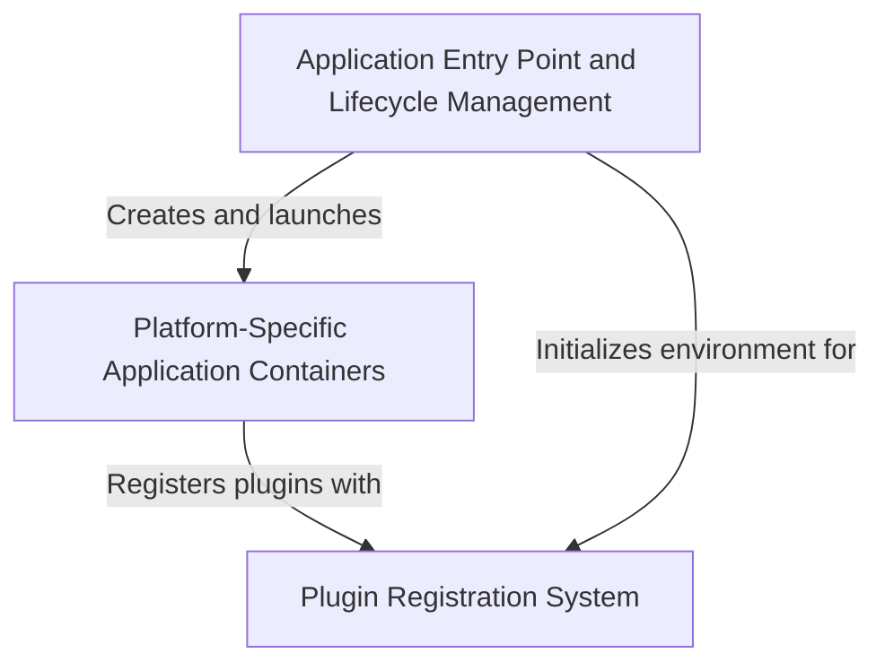

# Tutorial: Public_Safety_Application

This is a **Public Safety Application** built with Flutter that runs on both Windows and Linux. 
The app uses a three-layer architecture to bridge the gap between cross-platform Flutter code 
and native operating system capabilities:

- The **Application Entry Point and Lifecycle Management** acts like a car's ignition system, 
  starting the app, initializing critical services, and keeping everything running smoothly.
- **Platform-Specific Application Containers** serve as specialized "picture frames" that wrap 
  the Flutter app in the right native shell for each OS (Windows or Linux), handling OS-specific 
  window management and events.
- The **Plugin Registration System** functions as a universal translator, connecting Flutter's 
  cross-platform code to native device features like file selection, web browsers, GPS, and cameras.
  
When a user launches the app, the entry point starts the system, creates the appropriate container 
for their operating system, which then registers all necessary plugins, allowing emergency responders 
to access *native platform capabilities* through simple Flutter code.

**Source Repository:** [https://github.com/pruthvirajt24/Public_Safety_Application](https://github.com/pruthvirajt24/Public_Safety_Application)

## Chapters

1. [Application Entry Point and Lifecycle Management](01_application_entry_point_and_lifecycle_management.md)
2. [Platform-Specific Application Containers](02_platform_specific_application_containers.md)
3. [Plugin Registration System](03_plugin_registration_system.md)
